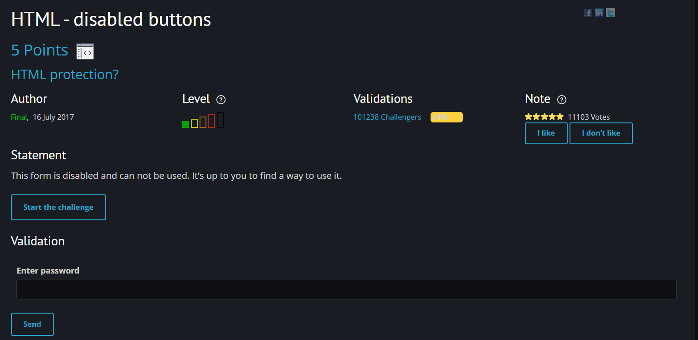
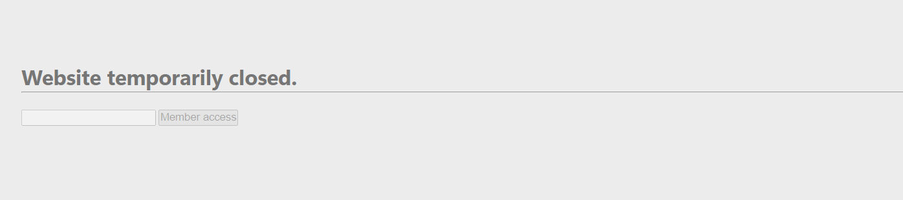
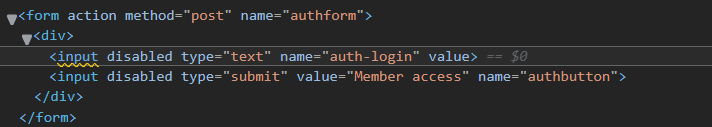
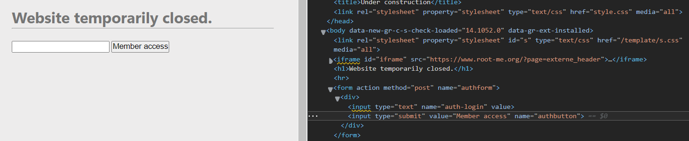
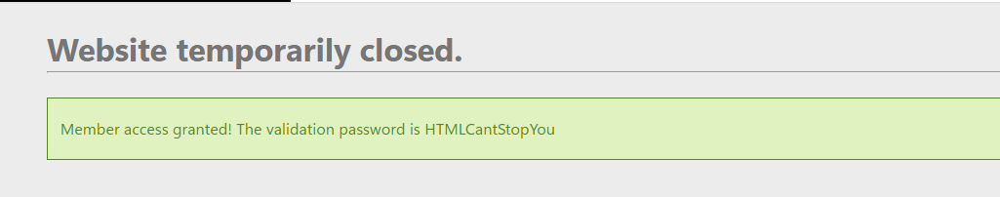

# [HTML - disabled buttons](https://www.root-me.org/en/Challenges/Web-Client/HTML-disabled-buttons)

Đây là một challenge mức độ siêu dễ, với mục tiêu là enable chiếc form đã cho sẵn để lấy password cần tìm.

Truy cập vào challenge, ta nhận thấy thẻ input và button đều bị disabled. 

Mở source code của trang web, ta dễ dàng tìm thấy được đoạn code của form. Nhiệm vụ của chúng ta đơn giản là xóa thuộc tính  `disabled` ở cả 2 thẻ.

Sau khi xóa, ta đã có thể tương tác với form.

Nhập vào kí tự bất kì vào input và nhấn `Member Access`, ta đã có ngay flag.

> **Flag: HTMLCantStopYou**
