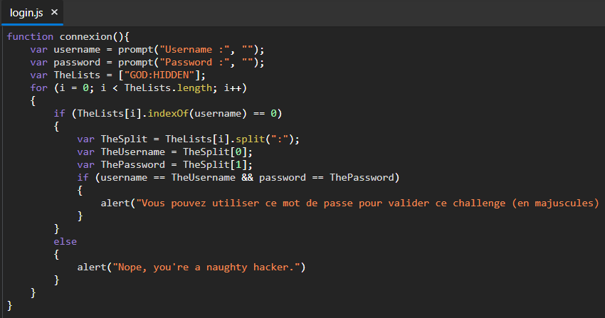

# [Javascript - Authentication 2](https://www.root-me.org/en/Challenges/Web-Client/Javascript-Authentication-2)

Đây cũng là một bài authentication mức độ dễ, thực hiện xác thực user bằng một đoạn javascript đơn giản.

Truy cập vào challenge, xuất hiện một button `login`. Ấn vào `login` xuất hiện pop up để mình nhập username:password. Ta thử với tài khoản `test:test` thì chương trình báo sai.

Mở source code của trang web, thì thấy event `onclick="connexion();"` của button `login`.

Ta dễ dàng tìm thấy hàm `connexion()` được định nghĩa trong 1 file javascript. Đoạn code này đơn giản là xác thực tài khoản ta đăng nhập. Tài khoản hợp lệ sẽ là `GOD:HIDDEN`.

Nhập tài khoản trên ta nhận được pop up báo thành công và `HIDDEN` chính là password cần tìm.

> **Flag: HIDDEN**