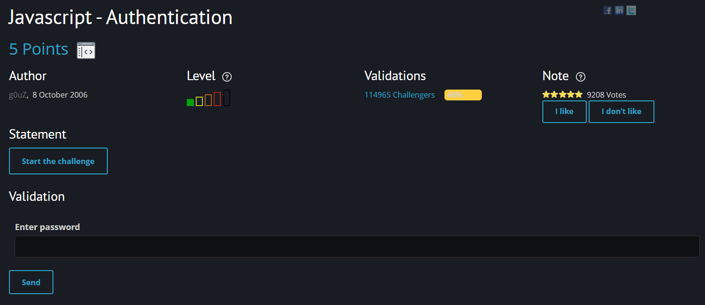
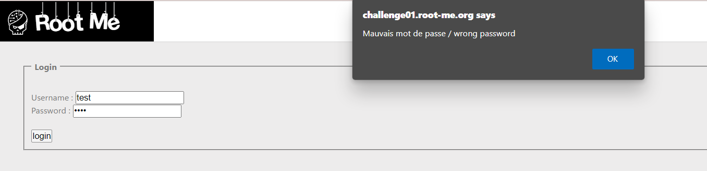
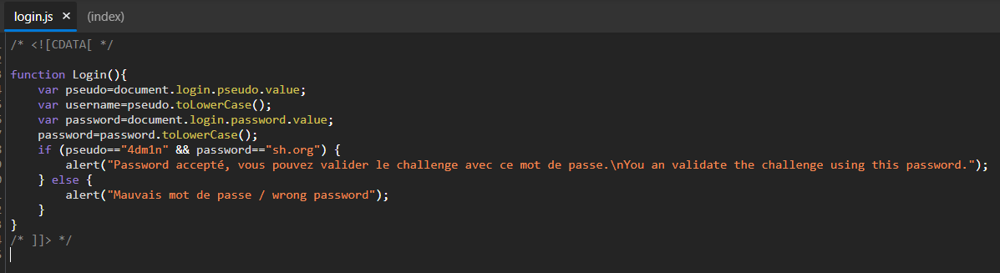
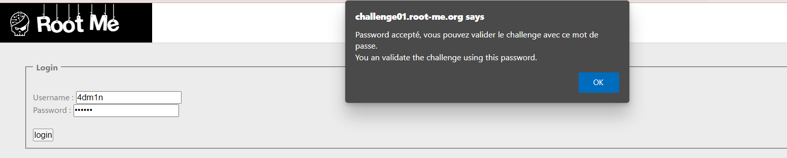

# [Javascript - Authentication](https://www.root-me.org/en/Challenges/Web-Client/Javascript-Authentication)

Đây là một bài mức độ dễ, thực hiện xác thực user bằng một đoạn javascript đơn giản.

Truy cập vào challenge, xuất hiện một form đăng nhập. Ta thử với tài khoản `test:test` thì chương trình báo sai.

Nhanh trí, ta đi tìm source code của trang web. Dễ dàng ta tìm được một file `login.js` dùng để xác thực tài khoản mình đăng nhập. Đọc source code và ta hiểu rằng tài khoản hợp lệ là `4dm1n:sh.org`.

Thực hiện đăng nhập, một pop up xuất hiện có nội dung là password `sh.org` chính là flag cần tìm.

> **Flag: sh.org**