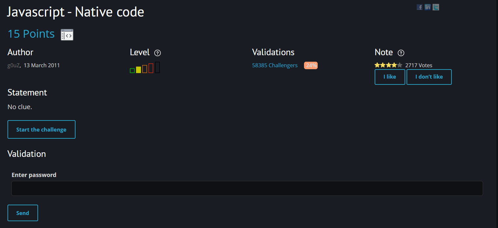
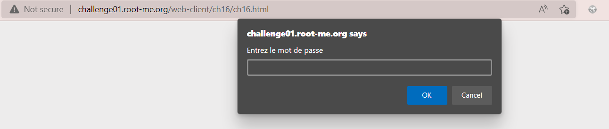
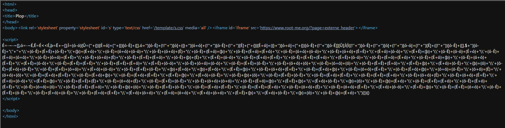
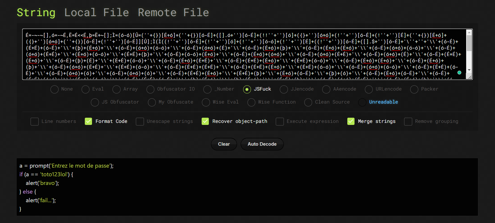

# [Javascript - Native code](https://www.root-me.org/en/Challenges/Web-Client/Javascript-Native-code)

Đây cũng là một challenge mức độ dễ, đi tìm password từ các script của javascript.

Truy cập vào challenge, xuất hiện một button `login`. Ấn vào `login` xuất hiện pop up để mình password. 

Mở source code của trang web, thì ta thấy một đoạn script được viết bởi một số kí tự nhất định. Thực hiện tìm kiếm trên google, mình phát hiện đây là 1 dạng obfuscation của JS và ta cần dùng tool để deobfuscate đoạn script. 

Ở đây mình dùng [tool](https://lelinhtinh.github.io/de4js/) để giải mã. Sau khi deobfuscate thì ta dễ dàng đọc code và hiểu rằng `toto123lol` chính là password cần tìm

> **Flag: toto123lol**