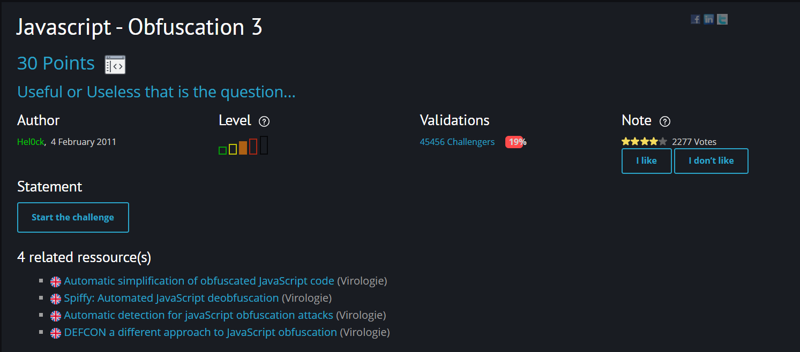
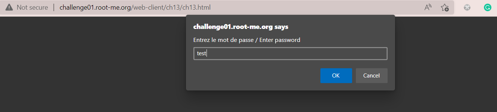
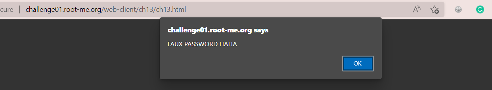
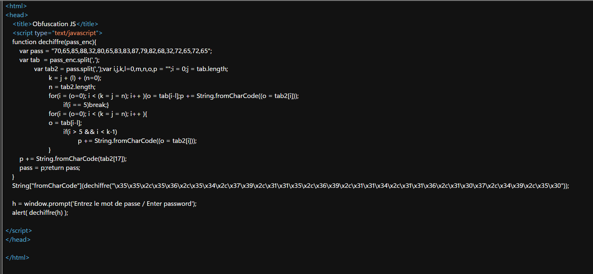
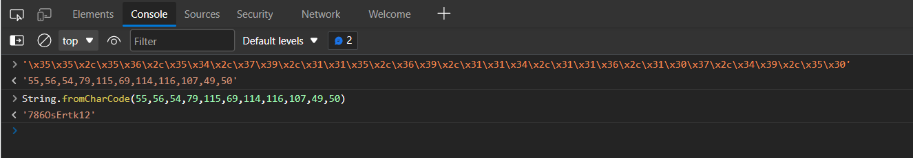

# [Javascript - Obfuscation 3](https://www.root-me.org/en/Challenges/Web-Client/Javascript-Obfuscation-3)

Đây cũng là một challenge mức độ tương đối dễ, đi tìm password từ các script bị obfuscated.

Truy cập vào challenge, xuất hiện pop up để nhập password. 

Test thử với password bất kì thì pop up báo `FAUX PASSWORD HAHA`.

Ta mở source code thì thấy một đoạn script định nghĩa hàm `dechiffre()`. Đọc hiểu hàm `dechiffre()` thì thấy nó luôn luôn trả về giá trị của biến `pass`, chính là `FAUX PASSWORD HAHA`. Vì vậy cho nên, hàm này coi như chỉ để đánh lừa người đọc. 

Tuy nhiên, đoạn script còn xuất hiện một đoạn string dạng byte. Ta thử đưa vào Console để giải mã như hình trên thì kết quả trả về chuỗi `7860sErtk12`. Thử submit với password này thì thấy thành công.

> **Flag: 7860sErtk12**