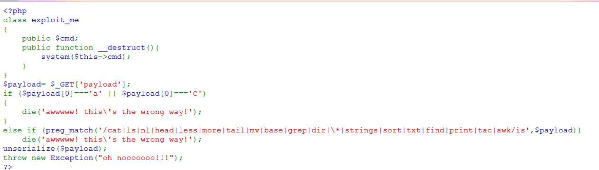
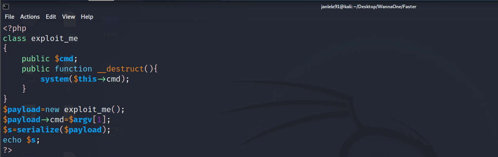
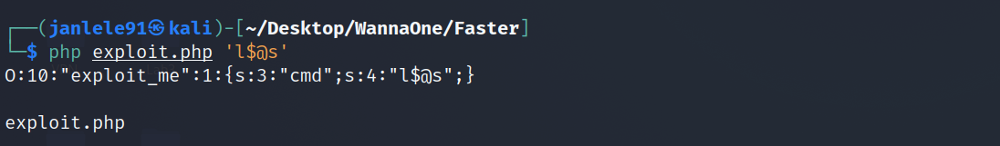
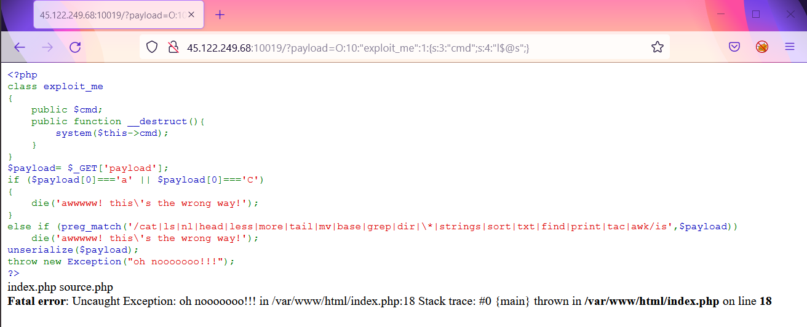
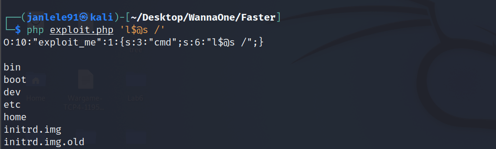
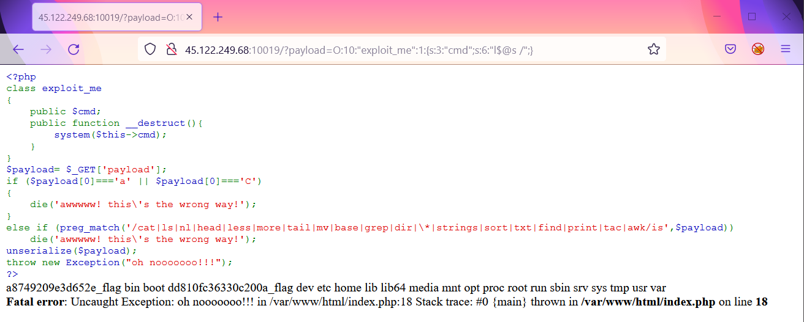
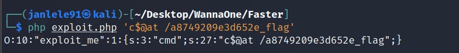
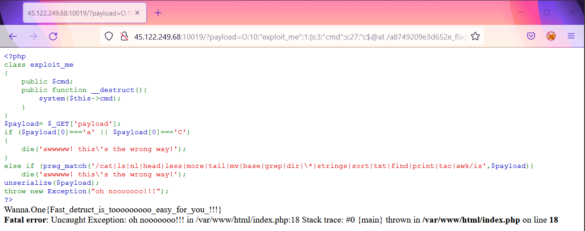

# **Faster - Web CTF Challenge**

### ***Background and ideas***
---

Look at the source code, we can see the common vulnerability of Insecure Deserialization in PHP. You can dig deeper into this vulnerability via this [link](https://portswigger.net/web-security/deserialization/exploiting).

This program allows us to execute OS commands through a function `__destruct()` which is automatically called when deserializing an object belongs to `exploit_me` class. 

Besides, we have to bypass some filters displayed on the source code. Because `a` and `C` can't be the first characters of payload, we need to create a serialized object of `exploit_me` with the suitable `cmd` argument. 

The `cmd` also need bypassing listed commands such as: `cat, ls,...`. The solution here is inserting `$@` in the middle of these commands. For example: `c$@at` or `l$@s`.

### ***Exploitation***
---

Based on above analysis, we implement a PHP code to serialize an `exploit_me` object with an input of `cmd` argument.  

First, we test the `ls` command successfully. Remember to add `$@` in the middle to bypass filters.

Copy the above serialized object and paste to the `payload` argument on the URL with `GET` method. You can see there are 2 files `index.php`  and `source.php` in the current directory. 

So we sucessfully exploit the server with a serialized object payload. Now we just have to find the flag file with other `cmd` argument.

Test the new payload of `l$@s /` to see the files and directories in root directory. Oops, there are 2 flag files in the root directory.

Let's make serialized objects to view the content of these 2 files. Starting with the first flag: `c$@at /a8749209e3d652e_flag`.

Paste it in the `payload` argument in URL and you can see the desired flagggggg. No need to care the second one.

Such an easy challenge, right? 

---

> **FLAG: Wanna.One{Fast_detruct_is_tooooooooo_easy_for_you_!!!}**

