# **DUMP.RAW**

## **Description**

Dường như đã có hành vi bất thường trên laptop của NHK, bạn có thể giúp chúng tôi điều tra: 
- Thu thập các file bất thường để ghép mảnh flag.
- Liệu họ có để lại những dấu vết trên trình duyệt web?.
- Và hình như kẻ xâm nhập bằng một cách nào đó đã lấy được password laptop của NHK. Hãy tìm password đó.

## **Writeup**

Win7SP1x64 là profile được chọn.

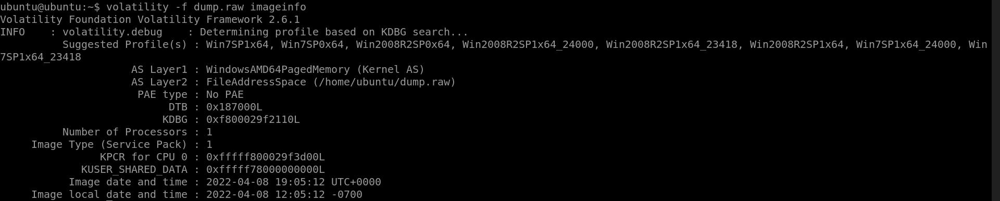

#### ***Challenge 1:** Ghép các file khả nghi thành flag.*

Sau một thời gian kiểm tra các tiến trình không có gì đặc biệt, mình sử dụng plugin `shellbags` để trích xuất thông tin từ registry xem timeline lần cuối user truy cập thư mục và file gì.

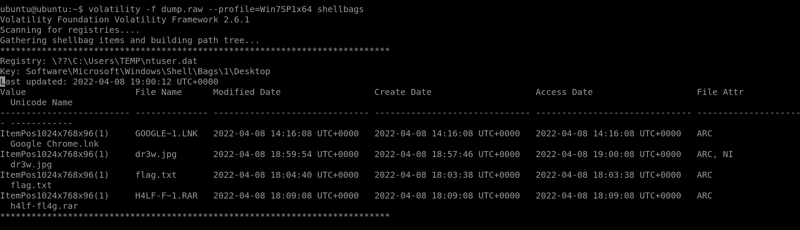

Điều đặc biệt xuất hiện 3 file khả nghi là `dr3w.jpg`, `flag.txt` và `h4lf-fl4g.rar`. 

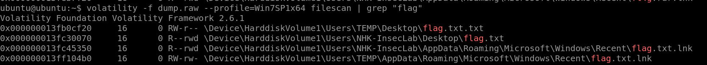
 
Sử dụng filescan để kiếm file flag.txt
 
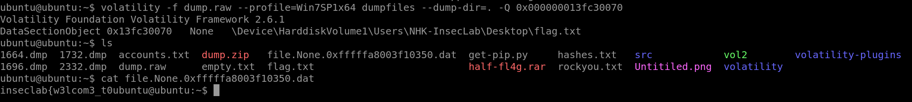

Thực hiện dumpfiles dựa trên virtual address của file, ta có được file flag.txt. Thực hiện xem nội dung thì mình có được 1 nửa flag như sau: `inseclab{w3lcom3_t0`
 
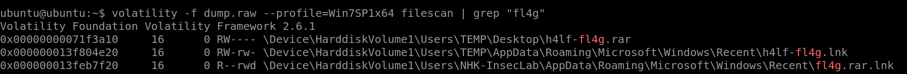
 
Thực hiện tương tự với file `h4lf-fl4g.rar`. Tuy nhiên file rar này có chứa mật khẩu. 

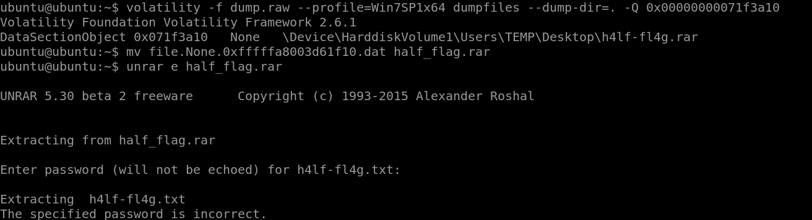

Đến đây mình sẽ dùng `john the ripper` để crack mật khẩu. Sử dụng `rar2john` để hash file rar về dạng john hiểu được và lưu vào `hash_flag.txt`. 

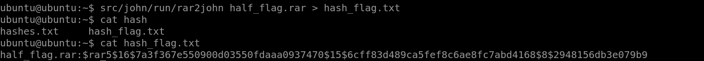
 
Download wordlist rockyou.txt và thực hiện câu lệnh sau:

```console
ubuntu@ubuntu:~$ john –wordlist=rockyou.txt hash_flag.txt.
```

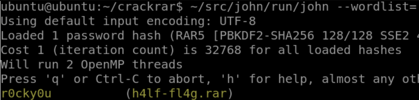

Ta có ngay password của file rar là `r0cky0u`.

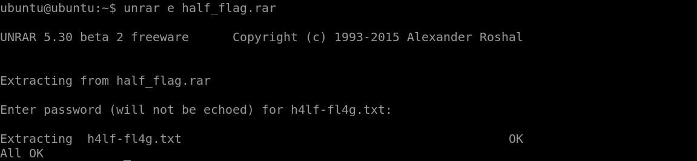
 
Giải nén file rar kèm mật khẩu tìm được, ta có file `h4lf_fl4g.txt`.

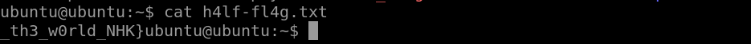
 
Thực hiện xem nội dung, ta có nửa flag còn lại: `_th3_w0rld_NHK}`
Kết hợp 2 nửa flag, ta có flag cần tìm.
> **FLAG: inseclab{w3lcom3_t0_th3_w0rld_NHK}**

#### ***Challenge 2:** Tìm flag từ lịch sử web.*

Sau khi sử dụng `pslist` thấy user đã sử dụng chrome để truy cập web. Ta thực hiện download plugin `chromehistory` về để kiểm tra lịch sử chrome.
 
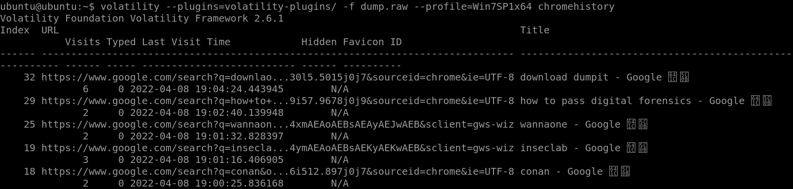

Kéo xuống dưới ta thấy một file pastebin bất thường.

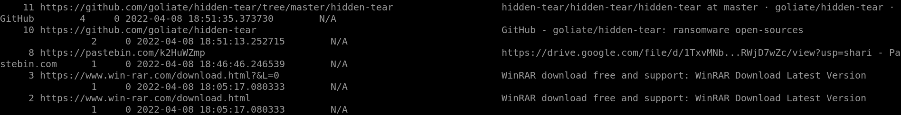

Truy cập vào link pastebin, ta có được một đường link share từ Google Drive.

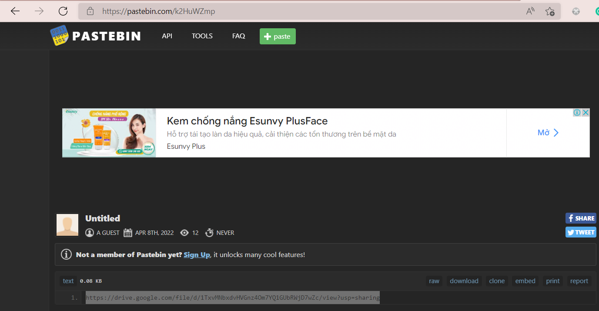

Truy cập ta có được 1 file text có nội dung khả nghi.

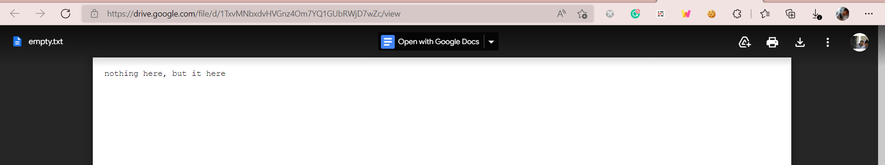

Thực hiện sử dụng xxd để xem file empty.txt dạng hex. 
 
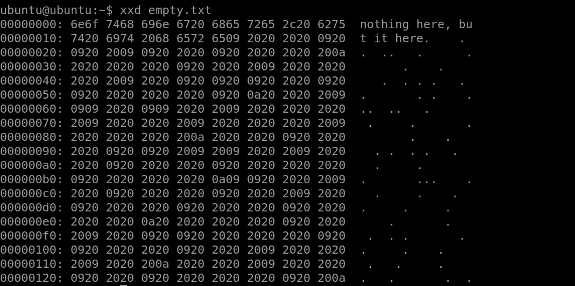
 
Có một điều đặc biệt đằng sau chuỗi ban đầu là một dãy có mã hex `0x20`, `0x09`, `0x2A` xen kẽ nhau ở dưới. Có vẻ như đây là một hình thức ẩn giấu thông tin gì đó. Thực hiện tra google, mình phát hiện đó là ngôn ngữ lập trình Whitespace. 

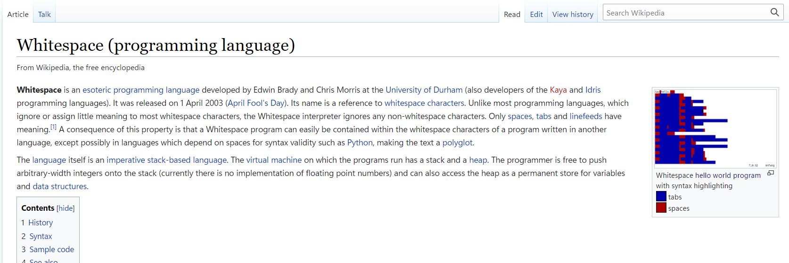

Một ngôn ngữ khá lạ và mình cần tool giải mã. Tìm hiểu và thấy `stegsnow` là một tool có thể làm được điều đó.

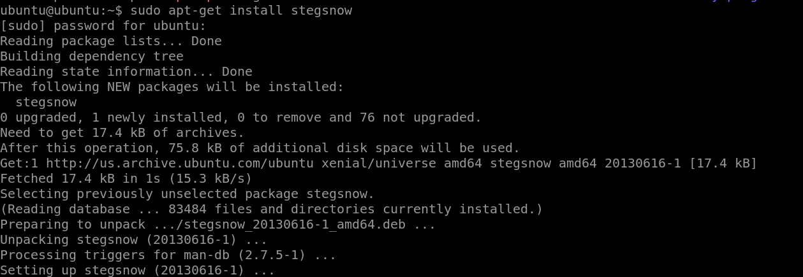
 
Thực hiện install và sử dụng `stegsnow -C empty.txt`, ta có ngay flag.

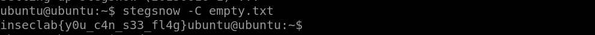

> **FLAG: inseclab{y0u_c4n_s33_fl4g}**

#### ***Challenge 3:** Tìm mật khẩu máy NHK.*

Sử dụng plugin `hashdump` để xem thông tin các account có trong máy. Mật khẩu của user `NHK-Inseclab` là thứ ta cần tìm.

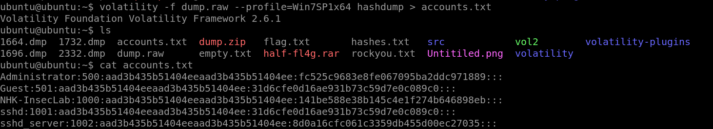

Thực hiện crack password của NHK-Inseclab bằng Crackstation không thành công.

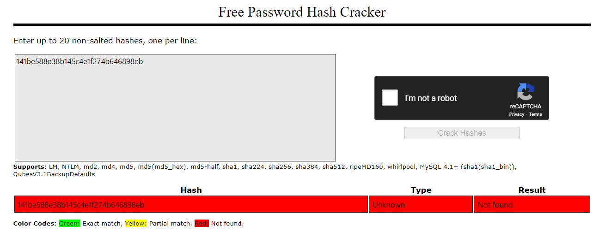
 
Sử dụng thử plugin `lsadump` , thì chỉ thấy password mặc định của máy ảo và một password của OpenSSH.

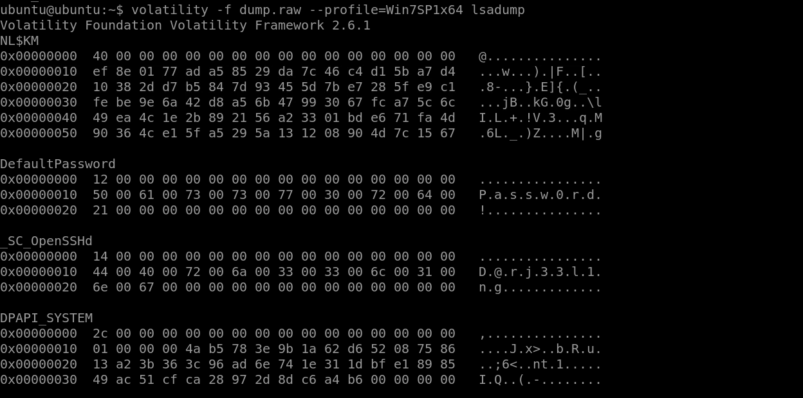
 
Chưa có gì đặc biệt. Đến đây, dựa vào kinh nghiệm Lab1 Memory Forensics, mình nhớ đến plugin `mimikatz` trong volatility có thể giải mã các tài khoản Windows.Các bước cài đặt có thể tham khảo [link](https://virtualception.wordpress.com/2016/05/15/volatility-mimikatz-plugin-installation-on-ubuntu-10/).
 
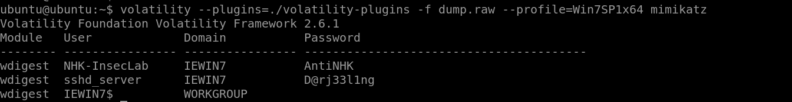

Sử dụng `mimikatz`, ta có ngay mật khẩu của user NHK-Inseclab là `AntiNHK`.

> **FLAG: inseclab{AntiNHK}**