# **Challenge: King of Memory Forensics** 🥵🥵

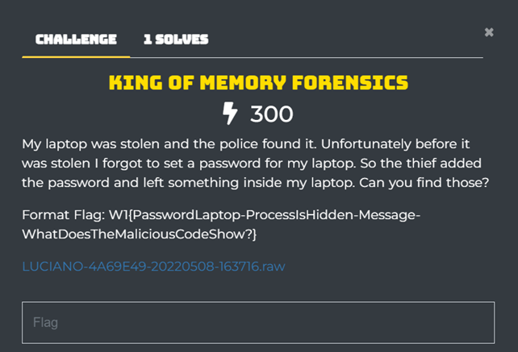

## **Writeup**

Đầu tiên, chúng ta sử dụng `imageinfo` để tìm profile cho file memory dump.

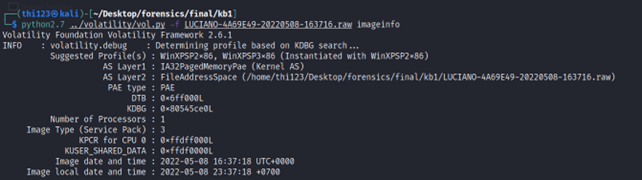
 
Vì Challenge gợi ý cho chúng ta tìm password của laptop nên chúng ta sẽ sử dụng `hashdump` và `mimikatz` plugin để dump user password, tuy nhiên không tìm thấy được gì.

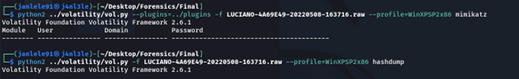
 
Sau một thời gian tìm kiếm, nhóm đã tìm được một tool là `Passware Kit Forensics`. Thực hiện chạy và tìm thấy password của laptop.

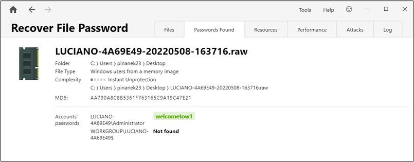
 
> **PasswordLaptop: welcometow1**

Tiếp theo, trong quá trình điều tra sử dụng plugin `consoles` để điều tra các lệnh được gõ thì chúng ta phát hiện một rootkit driver được compile.

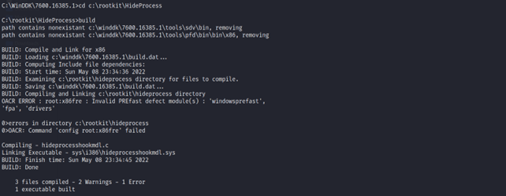
 
Sử dụng `filescan` plugin và lệnh grep để tìm kiếm các file có liên quan đến rootkit.
 
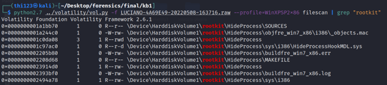

Thực hiện dump driver `HideProcessHookMDL.sys` và sử dụng IDA Pro để phân tích nó thì ta thu được một message bên trong hàm `DriverEntry`.

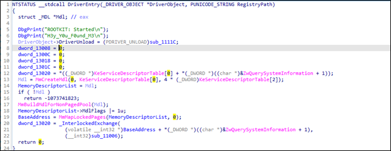
 
> **Message: H3y_Y0u_F0und_M3**

Dựa vào kinh nhiệm làm việc với rootkit từ trước, ta nhận thấy rằng driver rootkit này sẽ thực hiện che dấu một tiến trình nào đó khi được kích hoạt và tên của tiến trình được ẩn sẽ được so sánh ở một nơi nào đó trong chương trình. Trong hàm `sub_11006`, ta tìm được lệnh so sánh khả nghi.

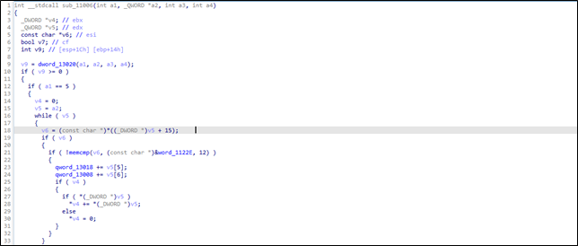

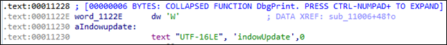
 
Tìm đến địa chỉ `word_1122E`, ta thu được chuỗi `WindowUpdate`

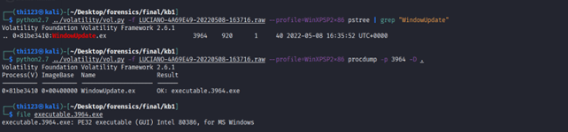
 
> **ProcessIsHidden: WindowUpdate**

Cuối cùng, ta thực hiện dump file `WindowUpdate.exe` và thực thi nó trên một máy ảo Windows.

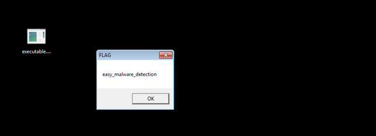
 
> **WhatDoesTheMaliciousCodeShow: easy_malware_detection**

Kết hợp tất cả các dữ liệu trên, ta có được flag cuối cùng:

> **FLAG: W1{welcometow1-WindowUpdate-H3y_Y0u_F0und_M3-easy_malware_detection}**