# **Challenge: King of Stegano** 🤬🤬

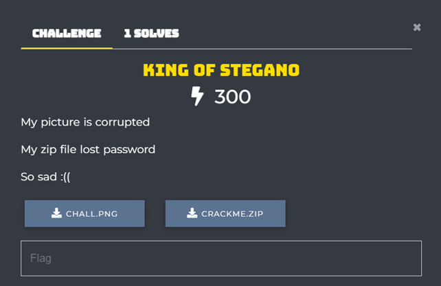

## **Writeup**

Kiểm tra file với file, ta thấy file không được coi là png.

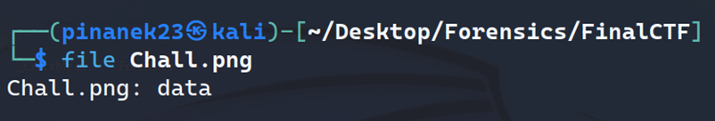
 
Kiểm tra với `xxd`, ta không thấy signature của PNG và phần cuối cũng thiếu chunk `IEND`.

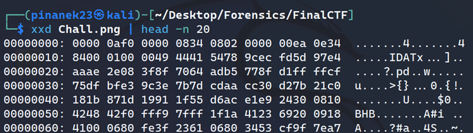
 
Ta thêm signature của file png là `89 50 4E 47 0D 0A 1A 0A`, thấy rằng nó cũng thiếu một chunk quan trọng là `IHDR`, ta thêm `00 00 00 0D 49 48 44 52`, và phần ở byte 0 đến chunk `IDAT` sẽ thuộc chunk `IHDR`. Và cuối cùng là thêm `IEND` là `49 45 4E 44 AE 42 60 82`.
 
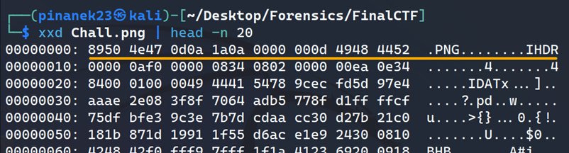

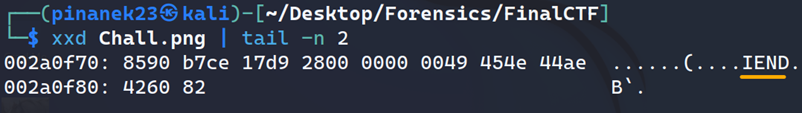

Kiểm tra lại với `pngcheck` và không có lỗi.

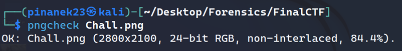
 
Sau một lúc thực hiện kiểm tra với các tool steganography nhưng không có kết quả, thử với tool `appa`, decode và có được phần đầu của flag: `W1-Y0u-4r3`.

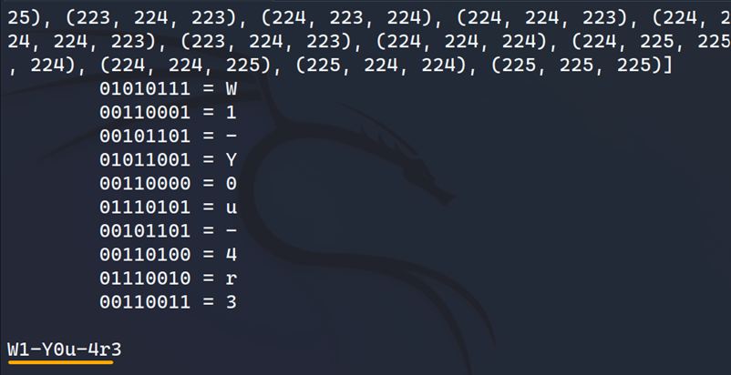
 
Tiếp theo đến với file zip `Crackme.zip`, thấy có 2 file một file là file `flag.txt`, hai là file `Chall.png`. Rất có thể đây là file `Chall.png` trước khi bị chỉnh sửa, từ đây có thể thực hiện crack file zip nhờ vào kỹ thuật  `plaintext-known`.

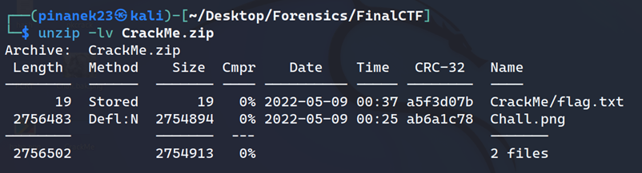
 
Sử dụng `pkcrack` để crack, ta cần một file zip chứa file `Chall.png` ta đã có (đặt tên lại là `PlainChall.png`). Kiểm tra lại đảm bảo 2 file cùng giá trị `CRC`.

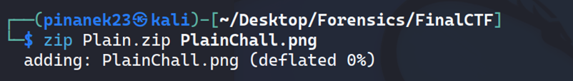

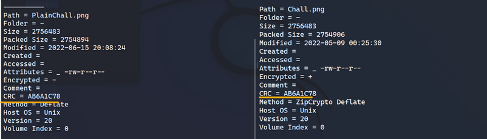
 
 
Thực hiện crack và đã thành công
 
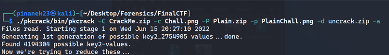 
 
Thực hiện unzip file đã được crach và có nửa flag còn lại: `-K1ng-0f-F0r3ns1cs`.

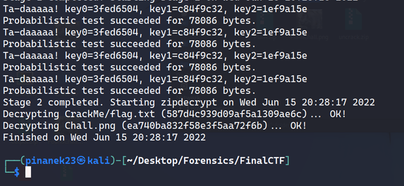

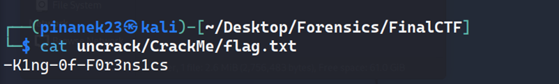

Kết hợp 2 nửa flag, ta có flag hoàn chỉnh:
 
> **Flag: W1{Y0u-4r3-K1ng-0f-F0r3ns1cs}**