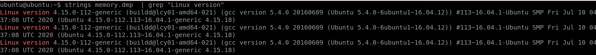
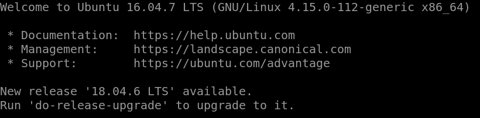
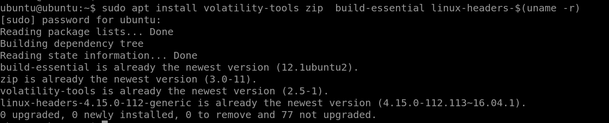
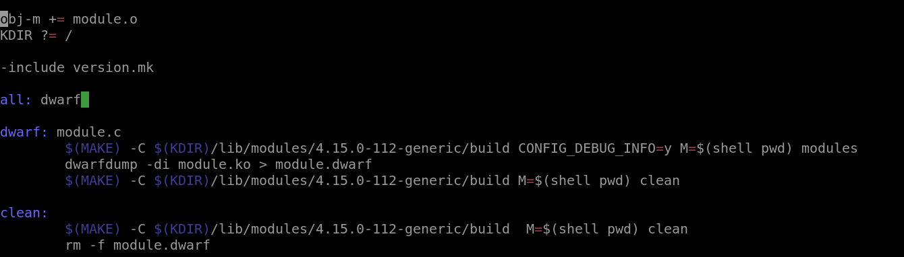
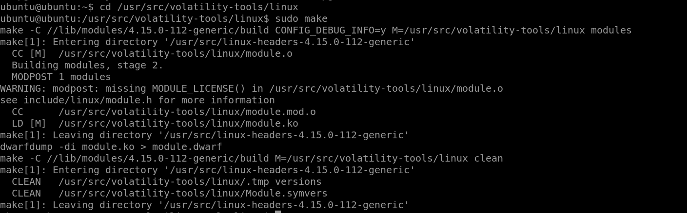
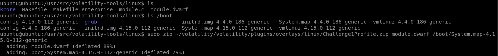
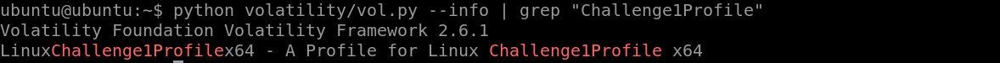
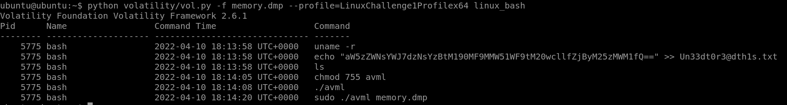
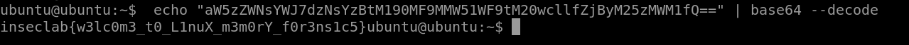

# **Faster - Web CTF Challenge**

### ***Description***
---

Có một command chứa thông báo lạ trong bash history, liệu bạn có thể khôi phục thông báo đó? Bạn phải xây dựng volatility và tìm profile.

### ***WriteUp***
---

Các bước build Linux profile sau được tham khảo trên 2 bài đọc sau:
- [Forensic :: Just sharing my notes... (redteams.fr)](https://redteams.fr/forensic/#screenshot)
- [Forense nella Nebbia: Building a Linux profile for Volatility 2 and 3](https://forensenellanebbia.blogspot.com/2021/02/building-profile-for-volatility-2-and-3.html)

**Bước 1:** Kiểm tra OS cũng như kernel version của file dump.



Sử dụng `strings memory.dmp | grep “Linux version”`, ta có thể thấy được đây là file dump từ máy Ubuntu có kernel `Linux version 4.15.0-112-generic`.
 
**Bước 2:** Thay đổi kernel version cho máy.
Để có thể build được đúng profile, ta cần dùng 2 lệnh sau để update kernel version cho máy hiện tại 

```console
ubuntu@ubuntu:~$ sudo apt install linux-image-4.15.0-112-generic
ubuntu@ubuntu:~$ sudo reboot
```


Kết quả sau khi thực hiện, ta thấy máy Ubuntu này đã có `kernel Linux version 4.15.0-112-generic`.
 
**Bước 3:** Thực hiện install các thư viện cần thiết



Trong đó, `linux-headers-$(uname -r)` chính là để linux headers thuộc kernel version hiện tại.

**Bước 4:** Thay đổi Makefile để chạy.



Thực hiện `cd /usr/src/volatility-tools/linux`, sửa đổi Makefile ở thông số M thành `M=$(shell pwd)` để lưu file ouput ra đường dẫn hiện tại. (Do file gốc `M=$(PWD)` bị lỗi).
 
**Bước 5:** Thực thi make để compile được file module.dwarf


 
**Bước 6:** Thực hiện build Profile.

Thực hiện build Profile cho challenge bằng câu lệnh sau:

```console
ubuntu@ubuntu:~$ sudo zip <ProfileName>.zip module.dwarf /boot/System.map-4.15.0-112-generic
```

 
Và vì mình dùng Volatility 2 nên cần đưa Profile vừa tạo vào thư mục `~/volatility/volatility/plugins/overlays/linux`.

**Bước 7:** Kiểm tra xem profile đã có trong volatility chưa.
 


Có thể thấy profile mình vừa tạo được chèn thêm chữ Linux x64 vào đầu và cuối tên profile. Đến đây quá trình build profile đã thành công.

**Bước 8:** Phân tích file memory.dmp với profile vừa tạo.

Dựa vào mô tả của bài, ta dùng ngay plugin `linux_bash` để xem bash history có gì đặc biệt.



Dễ dàng nhận thấy một chuỗi base64 khả nghi.



Thực hiện decode và ta đã có ngay flag cần tìm.

> **FLAG: inseclab{w3lc0m3_t0_L1nuX_m3m0rY_f0r3ns1c5}**
