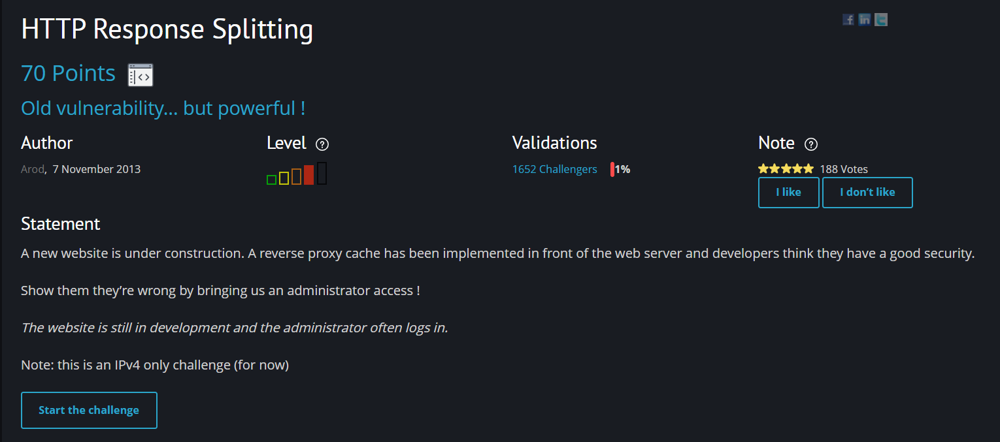
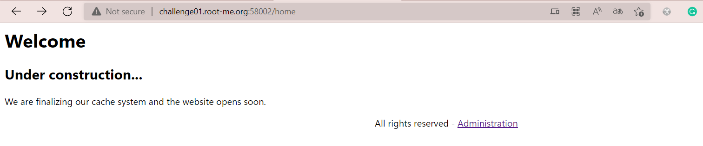
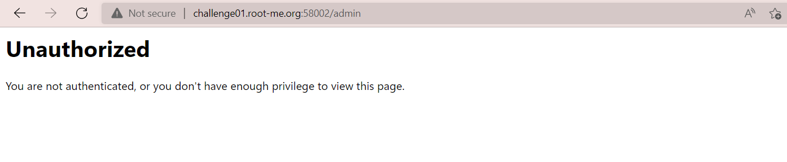
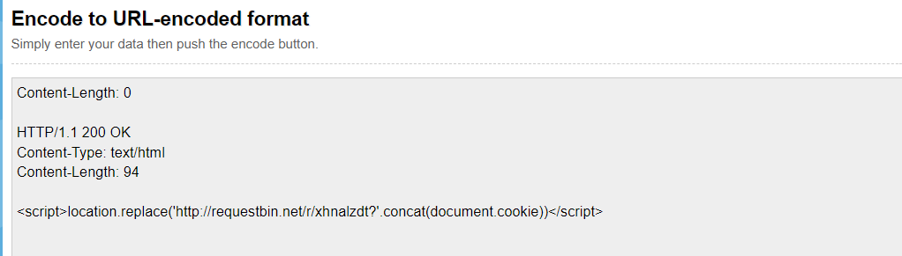
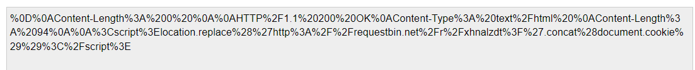
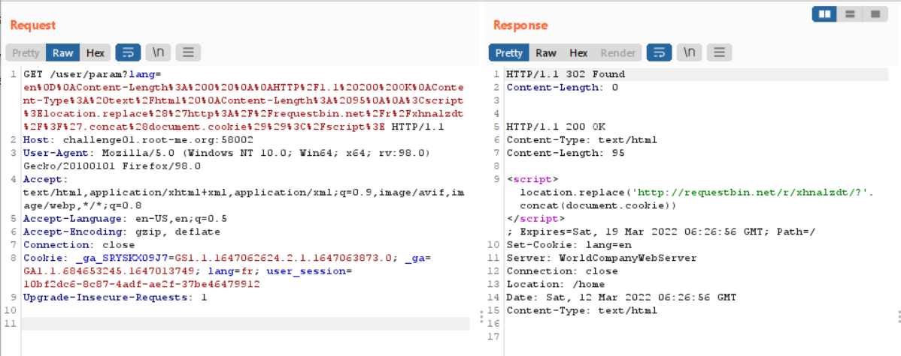
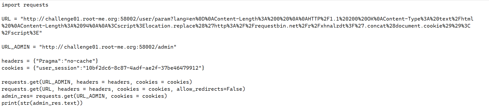
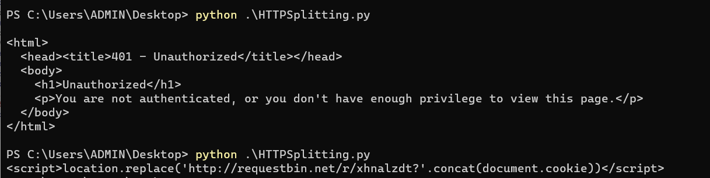
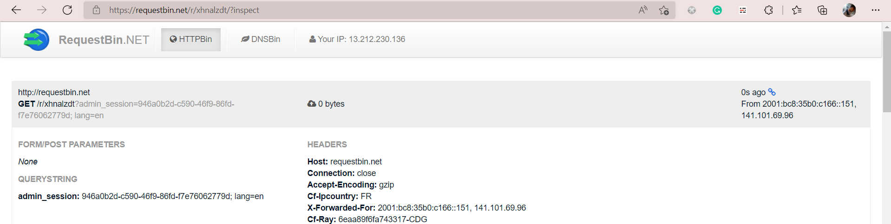
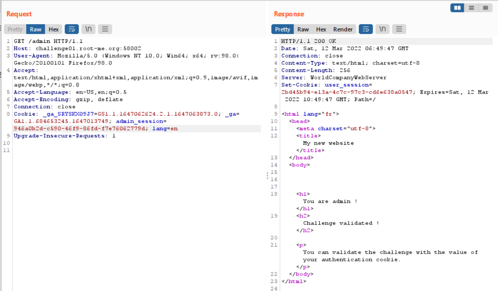

# [HTTP Response Splitting](https://www.root-me.org/en/Challenges/Web-Client/HTTP-Response-Splitting)

Đây là một bài về HTTP mức độ tương đối khó, yêu cầu chúng ta phải truy cập được vào trang admin để lấy flag. Cụ thể, website đang được bảo trì và tương tác cũng như cache với server thông qua một con reverse proxy. 

> Ý tưởng: Chúng ta sẽ sử dụng lỗ hổng **HTTP Response Splitting**, tận dụng cách trả response về client của proxy này để chiếm được admin session. 

> Lỗi **HTTP Response Splitting** tấn công vào ứng dụng web và diễn ra khi nó không thể xử lý đúng các thông tin đầu vào người dùng nhập. Attacker có thể gửi một HTTP request đặc biệt làm cho web server hoặc reverse proxy định dạng yêu cầu nhầm tưởng rằng nó chứa 2 yêu cầu HTTP  chứ không phải một. Khi đó, khi attacker gửi HTTP request thứ 2 thì server/proxy sẽ trả response thứ 2 mà nó hiểu nhầm ở trên chứ không phải response đúng.

Website này chỉ có 3 trang sau:

- **Language**: http://challenge01.root-me.org:58002/user/param?lang= `en/fr`
- **Home**: http://challenge01.root-me.org:58002/home

- **Administration page**: http://challenge01.root-me.org:58002/admin

Truy cập vào challenge, website yêu cầu chọn ngôn ngữ với phương thức GET có param là `?lang=`. Đây chính là nơi mình có thể nhét vào một response 200 OK trả về cookie của trang admin khi mình truy cập vào trang admin ở đường dẫn `/admin`. Ở đây ta nảy ra ý tưởng là payload sẽ chứa một đoạn javascript chuyển hướng đến một url của mình mà kèm theo cookie. 

Từ ý tưởng đó, mình viết được payload trên sẽ gửi cookie của admin đến một url chuyên nhận request do mình tạo ở trên `http://requestbin.net/`. Và để chèn được payload này vào param `lang=` thì ta cần urlencode đoạn payload này.

Đây là đoạn payload sau khi được encode (Nhớ thêm các byte `%0D%0A` ở đầu để xuống dòng nhằm tách payload khỏi param `lang`)

Ta sẽ thử bắt request bằng Burpsuite và chèn thêm payload trên để xem response của proxy trả về là gì. Như kết quả ở trên hình, mình đã chèn thành công khi mà proxy đã trả về 1 reponse 302 và 1 response 200 mặc dù chỉ có 1 request. Khi đó mình chỉ việc truy cập vào `/admin` để lấy cookie vì proxy sẽ trả về 200 OK chứ không phải 401 Unauthorized nữa.

Thay vì gửi request thủ công, mình sử dụng Python viết một đoạn code như trên để giảm thiểu độ trễ giữa request thứ 1 và request thứ 2. Cụ thể, mình sẽ lấy cookies từ phiên mình đang sử dụng, gửi request đến 2 url: URL chứa payload của mình và URL_ADMIN tại `/admin`. Nhớ thêm thuộc tính `allow_redirects=False` để tránh web chuyển sang trang `home` sau request thứ nhất `lang=en`.

Thực thi file Python trên cho đến khi nó trả về `<script>location.replace...`. Điều này có nghĩa là request đến trang admin đã được xử lý với response 200 OK mà mình đã chèn trong payload. Bây giờ, việc của mình chỉ là vào url requestbin mà mình đã tạo để lấy cookie của admin.

Sau một khoảng thời gian 2, 3 phút thì mình nhận được admin cookie như trên hình. Như vậy mình đã có `admin_session`, và sử dụng cookie này mình sẽ truy cập được vào trang admin.

Mình đã thử và thành công :D. Trang admin báo mình đã truy cập thành công và flag chính là cookie `admin_session`.

> **Flag: 946a0b2d-c590-46f9-86fd-f7e76062779d**