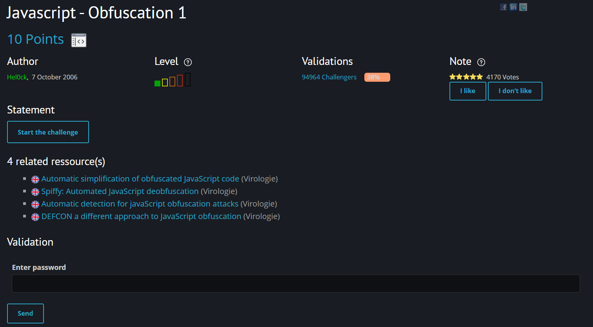
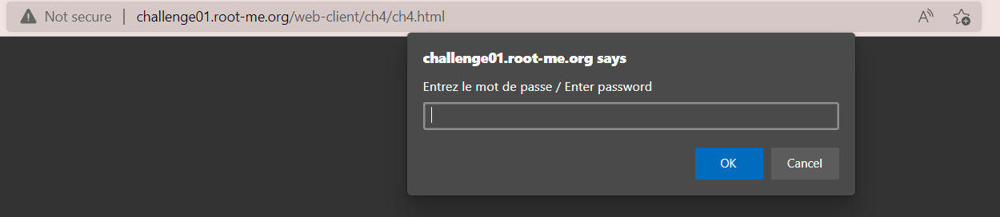
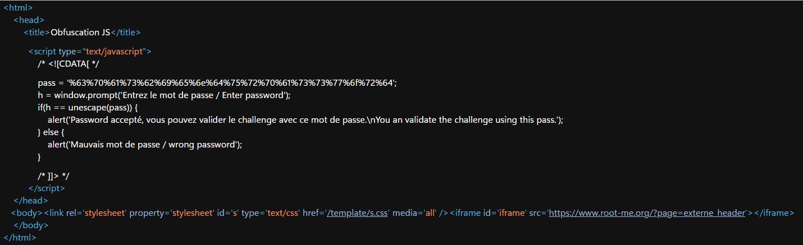
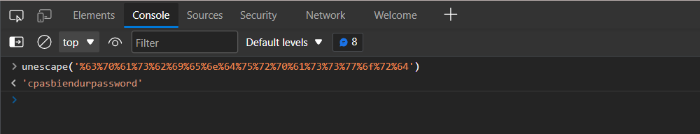

# [Javascript - Obfuscation 1](https://www.root-me.org/en/Challenges/Web-Client/Javascript-Obfuscation-1)

Đây cũng là một challenge mức độ dễ, đi tìm password từ các script của javascript.

Truy cập vào challenge, xuất hiện một pop up yêu cầu password mà chúng ta cần đi tìm. 

Mở source code của trang web, thì ta thấy một đoạn script, trong đó password cần tìm đang được biểu diễn dưới dạng byte. 

Sử dụng hàm `unescape()` trong mục Console, ta có được password cần tìm là `cpasbiendurpassword`.

> **Flag: cpasbiendurpassword**