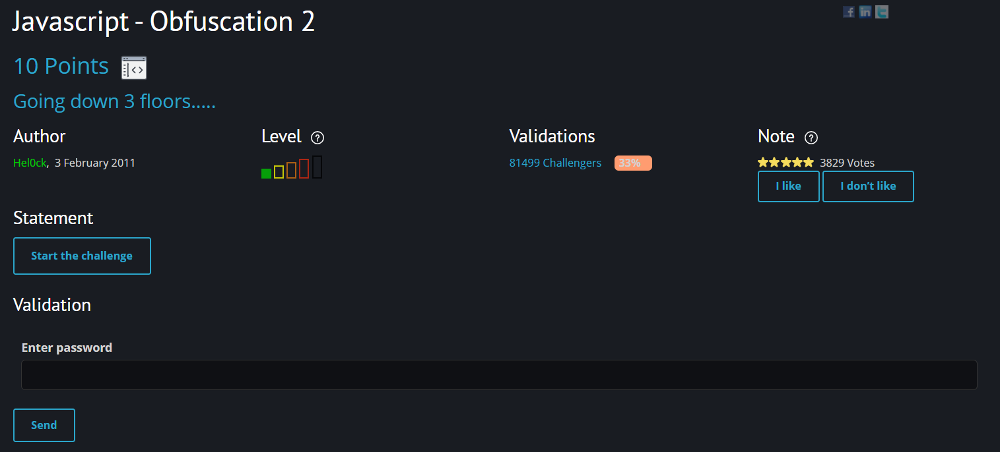
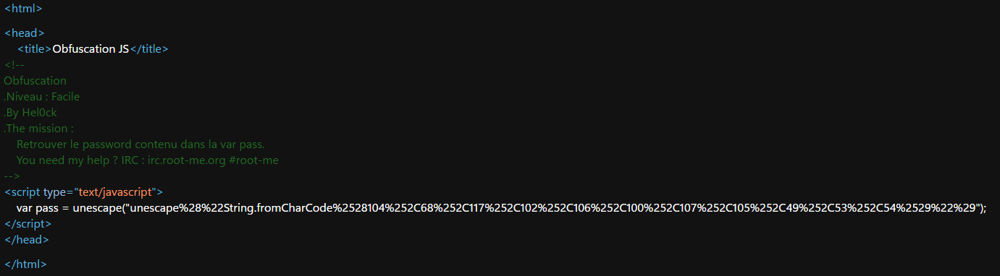
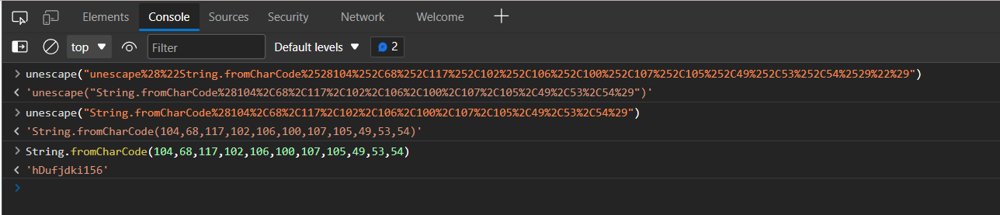

# [Javascript - Obfuscation 2](https://www.root-me.org/en/Challenges/Web-Client/Javascript-Obfuscation-2)

Đây cũng là một challenge mức độ dễ, đi tìm password từ các script của javascript.

Truy cập vào challenge, chúng ta thấy một trang web trống rỗng. Mở source code của trang web, thì ta thấy một đoạn script chỉ lưu duy nhất 1 biến `pass`, chính là password chúng ta cần tìm. Biến `pass` là kết quả của hàm `unescape()`.

Ta đưa nó vào Console và lần lượt trải qua 2 hàm `unescape()` và 1 hàm `String.fromCharCode()` thì ta tìm được password là `hDufjdki156`. 

> **Flag: hDufjdki156**