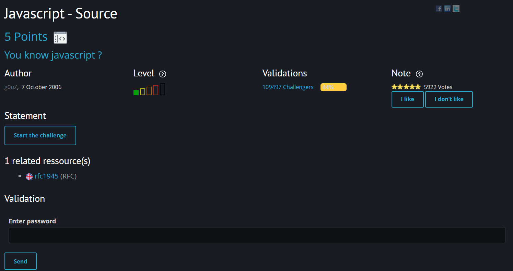
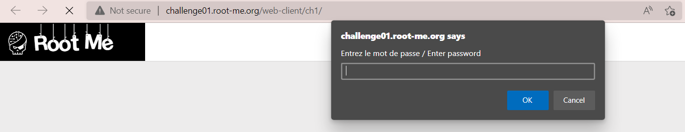
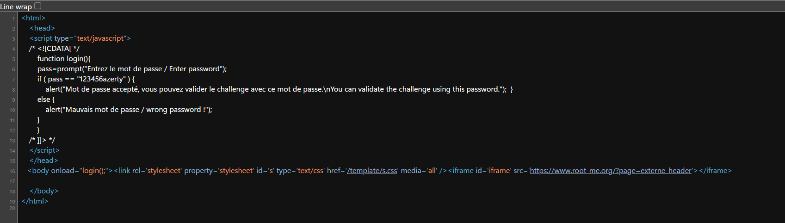

# [Javascript - Source](https://www.root-me.org/en/Challenges/Web-Client/Javascript-Source)

Đây là một challenge mức độ siêu dễ, với mục tiêu là enable chiếc form đã cho sẵn để lấy password cần tìm.

Truy cập vào challenge, một pop up xuất hiện yêu cầu nhập password.

Mở source code của trang web, ta phát hiện thấy một đoạn script validate password người dùng nhập vào. Nếu như nó là `123456azerty` thì thành công. Như vậy đây chính là flag cần tìm.

> **Flag: 123456azerty**
